# Usage Guide

## Get Started

Thanks for using our theme!

To set up the theme exactly like our demo stores, you may need to install the our free app **PapaThemes Widgets**. This app provides additional widgets to build the content in Page Builder visually without coding skill. 

For displaying your Instagram photos on your website, you can use our free tool [PapaThemes Instagram](https://instagram.papathemes.com/). We will guide you step by step later in this manual.

### Installing PapaThemes Widgets App

Find and install **PapaThemes Widgets** app from [BigCommerce Apps Marketplace](https://www.bigcommerce.com/apps/).

After installed, go to your admin page, on the left sidebar, click **Apps** >** My Apps**, click **Launch** button of PapaThemes Widgets app to open the app:

Then click the Install buttons in turn to install all widgets for Beautify theme:

Go to Storefront > My Themes > click Customize in dropdown menu of Beautify theme to open Page Builder. Select any theme style to start:

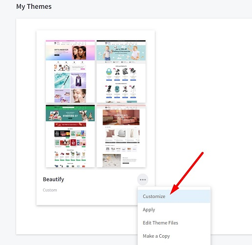

Verify the widgets installed successfully if they appear in Page Builder:

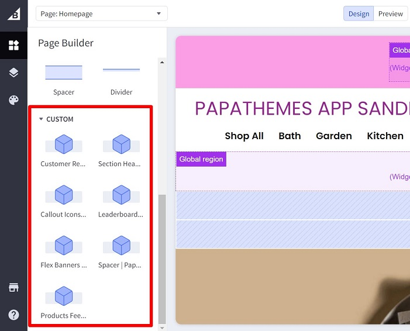

## Setting Up Cosmetics Home Page

In your admin page, go to **Storefront** > **My Themes**, click **Customize** in the dropdown menu of Beautify theme, select **Cosmetics** style, then click **Continue** button to open Page Builder.

### Top Banner

To create the top banner, go to **Marketing** > **Banners** > click **Create a Banner** button.

Enter Banner Name, Banner Content. Select **Show on Page** = `Home Page`. Select **Location** = `Top of Page`. Then click **Save** button to finish.

Configuring the top banner colors in **Page Builder** > **Theme Styles** > **General** > **Top Banners**:

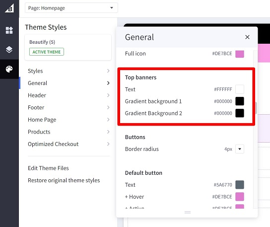

### Header

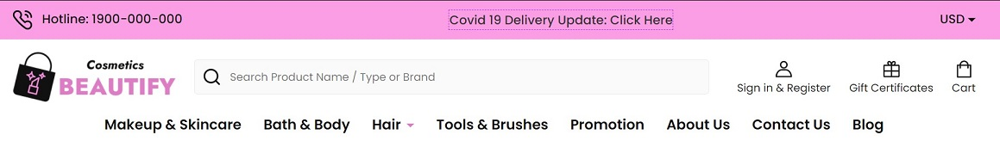

Editing the phone number in **Store Setup** > **Store Profile** > **Phone**.

Editing the currencies list in **Store Setup** > **Currencies**.

The announcement (ie: _Covid 19 Delivery Update: Click Here_) displays on all pages. Drag the Text widget to this region to add it:

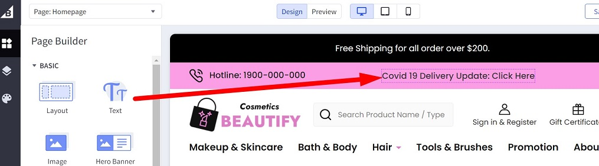

Changing the header's background color, the site name's text color, toggle auto hide/show header in **Page Builder** > **Theme Styles** > **Header** as showed in the screenshot below:

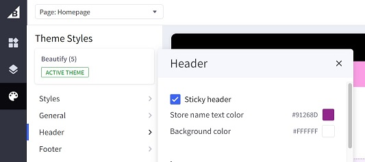

Changing the icons and links's colors (ie. Sign in & Register, Gift Certificates, Cart) in **Theme Styles** > **Headers** > **User navigation**:

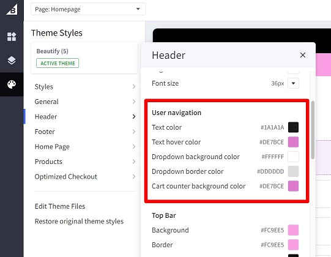

Changing the main navigation's colors in **Theme Styles** > **Header** > **Main navigation**:

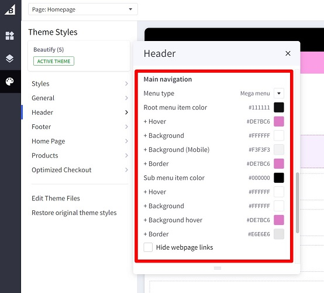

Changing the quick search form in **Theme Styles** > **Header** > **Quick search**:

### Home Page Carousel

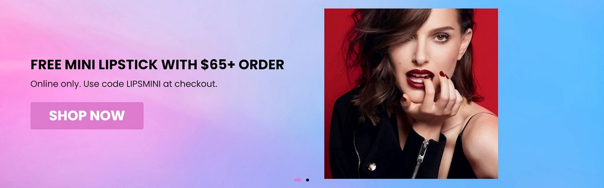

Creating the home page carousel in **Storefront** > **Home Page Carousel**.

You can:

- Turn off / on the home page carousel.
- Change colors.
- Change the content position of each slide.

Go to **Page Builder** > **Theme Styles** > **Home Page** > **Carousel**:

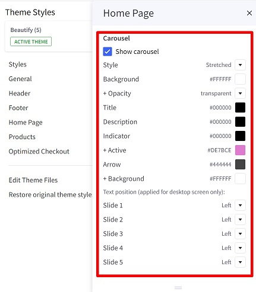

### Content Arrangement

You can arrange the content of the home page in Page Builder > Theme Styles > Home Pages > Sections, choose the content to display on each position.

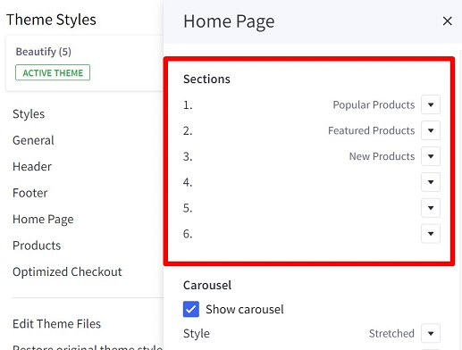

### New / Featured / Popular Products

You can configure number of products to display, number of products per row, display type (grid or carousel) in **Page Builder** > **Theme Styles** > **Home Page** > **Featured products** or **New products** or **Best-sellers products**:

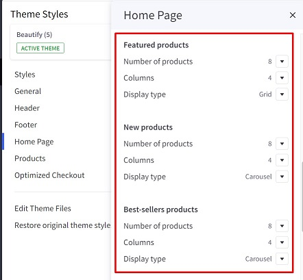

To set product as Featured, edit the product, select **Set as a Featured Product on my Storefront** as the screenshot below:

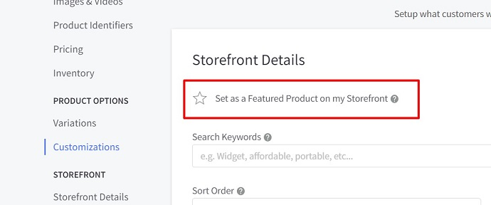

Popular products are automatically assigned by BigCommerce based on customer order analysis.

New products are automatically assigned by BigCommerce based on the product's added date.

### Newsletter Subscription Form

Enabling the newsletter subscription feature in **Marketing** > **Email Marketing**, tick on **Allow Newsletter Subscriptions**, enter the summary content in **Show Newsletter Summary** box if you want. See below screenshot for example:

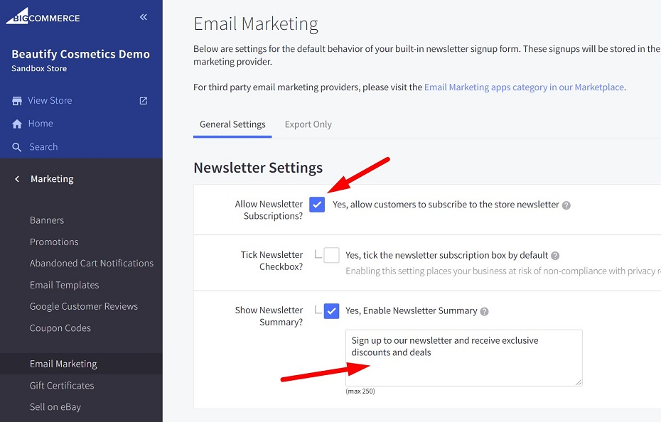

You can configure the heading, display style, colors, background image and toggle this newsletter form on the footer in **Page Builder** > **Theme Styles** > **Footer** > **Newsletter**:

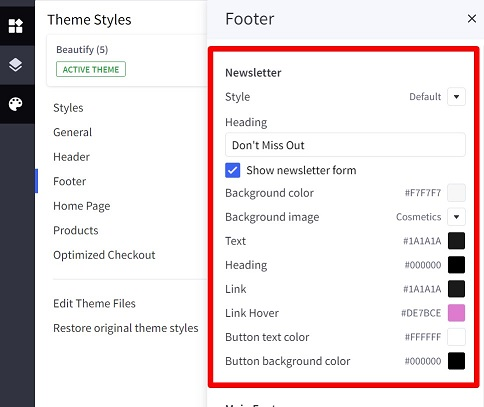

### Footer

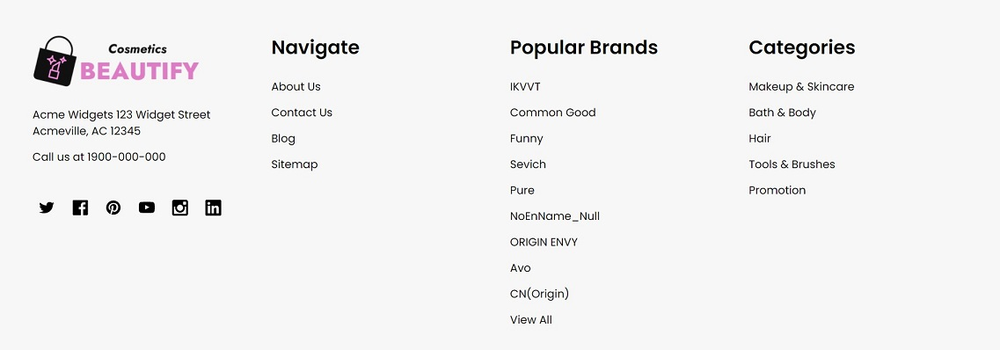

Configuring the footer in **Page Builder** > **Theme Styles** > **Footer** > **Main Footer**:

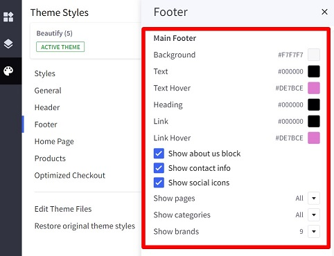

Configuring the social icons in **Storefront** > **Social Media Links**.

You can also add the custom cotent to the footer using widgets. Just drag the widget to the available regions:

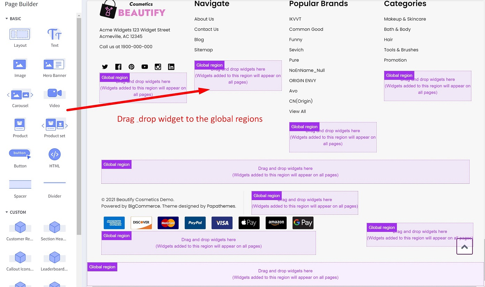

### Copyright

Configuring the copyright's colors in **Page Builder** > **Theme Styles** > **Footer** > **Copyright**:

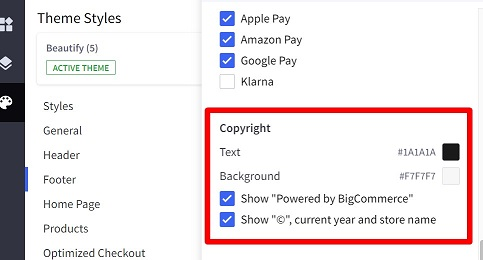

You can also toggle "Powered by BigCommerce" and "© current year and store name".

### Payment Icons & GeoTrust SSL Seal

Configuring the payment icons in **Page Builder** > **Theme Styles** > **Footer** > **Payment icons**:

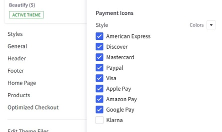

Configuring GeoTrust SSL seal in **Page Builder** > **Theme Styles** > **Footer** > **GeoTrust SSL**:

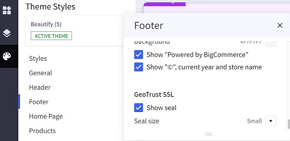

Note that GeoTrust SSL seal only displays if you purchase GeoTrust SSL Certificate from BigCommerce. Read more details [here](https://support.bigcommerce.com/s/article/BigCommerce-SSL-Certificate#features).

### Callout Icons

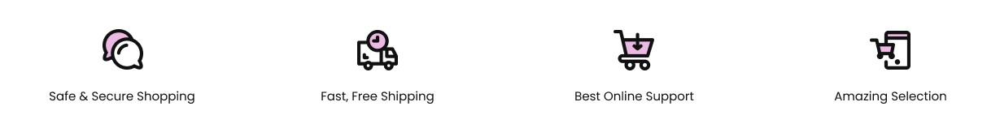

To display these icons, drag and drop **Callout Icons | PapaThemes Beautify** widget to the particular region:

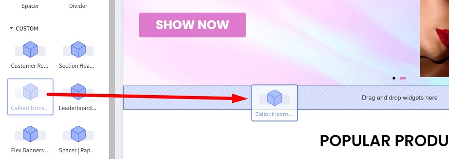

For Cosmetics style choose **Style** = `Large`, **Icon color** = `#ecb9e4`, **Icon size** = `Original`, **Text** style = `Theme`.

Select an icon in **Icon** list. You can also input your custom icon if selecting **Icon** = `Custom` then in put the SVG file content to the next text box. Or if selecting **Icon** = `Choose Image`, you can upload your image file.

Enter the link in **Link** text box.

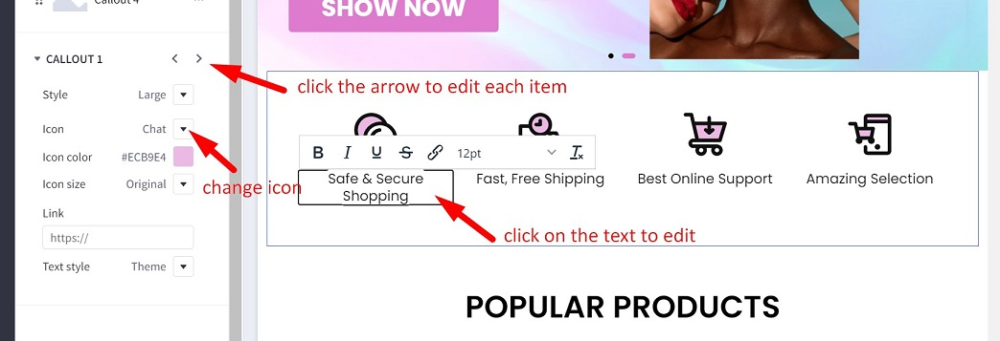

Click **Save** button to save your changes.

### Leaderboard Banner

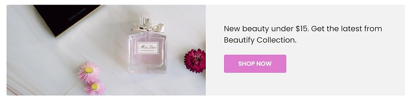

Drag & drop **Leaderboard Banner | PapaThemes Beautify** widget to a particular region.

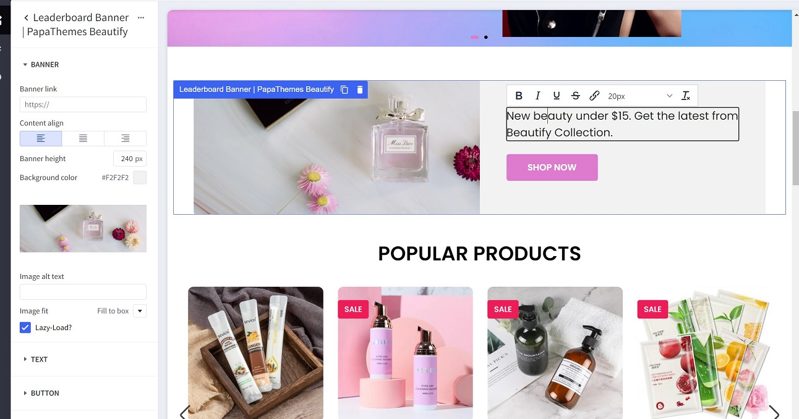

Click on the text or button to edit its content.

#### Widget Settings:

**Banners:**

- **Banner link**: Enter the banner link.
- **Content align**: setting content aligment left, center or right.
- **Banner height**: Specify the image height.
- **Background color**: Input the background color.
- **Image**: Upload your image.
- **Image alt text**: Image altenative text.
- **Image fit**: Display image fit to the box or cover the box.
- **Lazy-load?**: Use lazy-load image.

Text: 

- **Description style**: Text style, set `Theme` to use the theme style.
- **Text color**: Text color on desktop.
- **Text color** (mobile): Text color on mobile.

Button:

- **Button**: Show or hide the button.
- **Button style**: set `Theme default` to use the theme style.

### Flex Banners

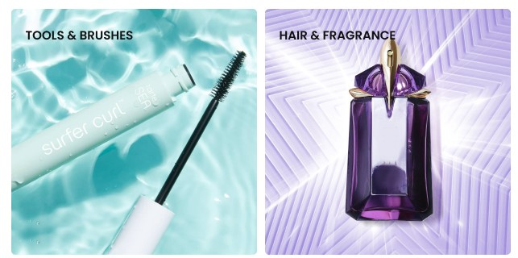

Drag & drop **Flex Banners | PapaThemes Beautify** widget to a particular region.

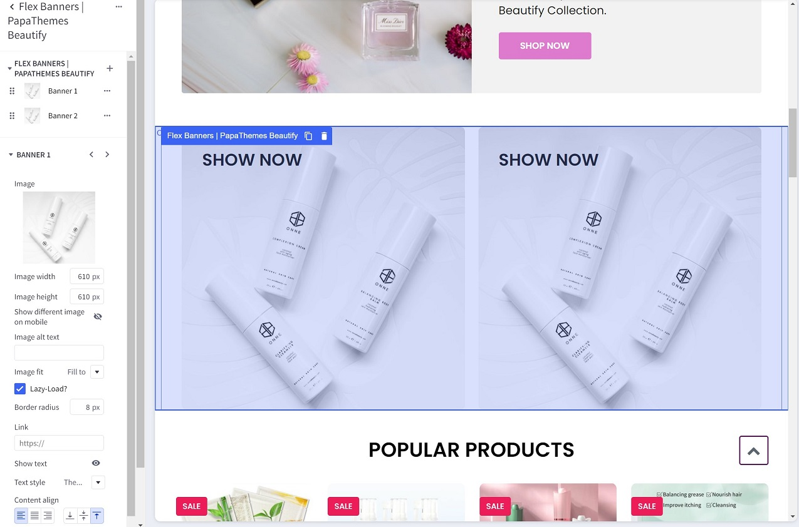

Click on the text or button to edit its content.

#### Widget Settings:

- **Image**: Upload your image.
- **Image width**: Specify the image width.
- **Image height**: Specify the image height.
- **Show different** image on mobile: Allows displaying a different image on mobile.
- **Image alt text**: Image alternative text.
- **Image fit**: Display image fit to the box or cover the box.
- **Lazy-load?**: Use lazy-load image.
- **Link**: Enter the banner link.
- **Show text**: Toggle text visibility.
- **Text style**: specify text style using the theme style or custom.
- **Content align**: align content left, right or center, top, bottom or middle.
- **Content padding**: Spacing around the text.
- **Action button**: Toggle the button visibility.
- **Style for theme**: pre-styled for some particular theme.
- **Your theme name**: Enter your theme name to allow you to customize its style using CSS.

### Spacer Widget

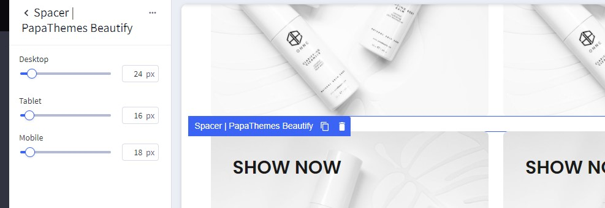

**Spacer | PapaThemes Beautify** widget allows adding spacing between widgets. It also supports different spacing on desktop, tablet and mobile.

### Customer Reviews Slider (or Testimonials)

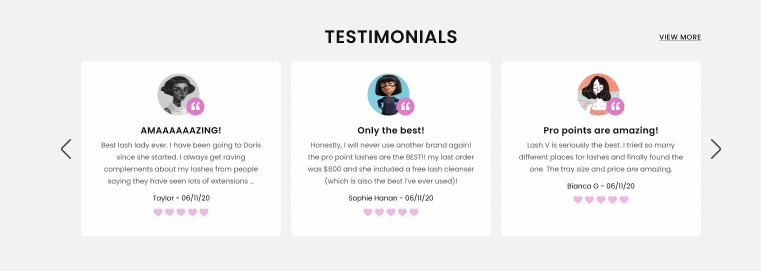

Drag & drop **Customer Reviews | PapaThemes Beautify** widget to a particular region.

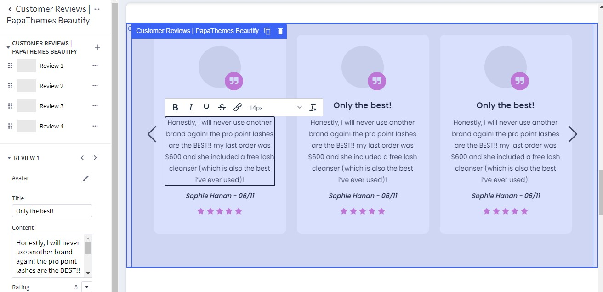

Click on the text or button to edit its content.

#### Widget Settings:

- **Avatar**: Choose avatar image or avatar color.
- **Title**: The review title.
- **Content**: The review content.
- **Rating**: The rating stars.
- **Author**: Reviewer name.
- **Style for theme**: pre-styled for some particular theme.
- **Your theme name**: Enter your theme name to allow you to customize its style using CSS.

## Setting Up Family Home Page

In **Page Builder** > **Theme Styles**, if your current style is not Family, click on **Family** thumbnail to apply:

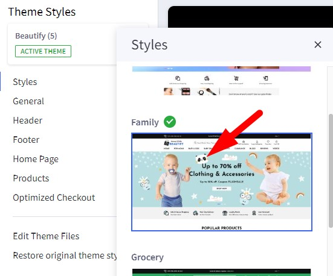

### General

These features are same as Cosmetics style:

- [Top Banner](#top-banner)
- [Header](#header)
- [Home Page Carousel](#home-page-carousel)
- [Content Arrangement](#content-arrangement)
- [New / Featured / Popular Products](#new-featured-popular-products)
- [Newsletter Subscription Form](#newsletter-subscription-form)
- [Footer](#footer)
- [Copyright](#copyright)
- [Payment Icons & GeoTrust SSL Seal](#payment-icons-geotrust-ssl-seal)
- [Leaderboard Banner](#leaderboard-banner)
- [Flex Banners](#flex-banners)
- [Spacer Widget](#spacer-widget)
- [Customer Reviews Slider (or Testimonials)](#customer-reviews-slider-or-testimonials)

### Callout Icons

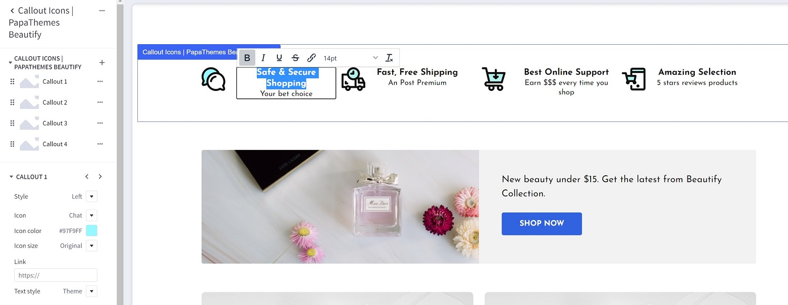

Follow [Callout Icons instruction](#callout-icons) in Cosmetics style to add the widget.

Set **Style** = `Left` and **Icon color** = `#97F9FF` for each callout icon. You can use the inline text editor to format the text font size and weight as you want.

### Flex Banners

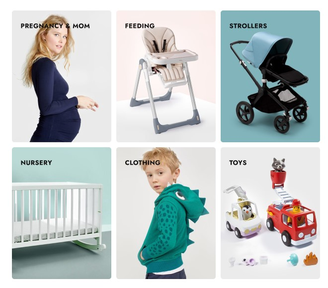

Follow [Flex Banners instruction](#flex-banners) in Cosmetics style to add the widget.

### Customer Reviews Slider (or Testimonials)

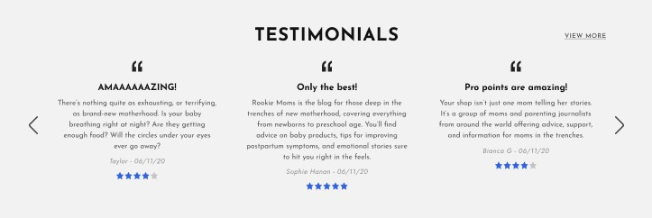

Follow [Customer Reviews Slider (or Testimonials) instruction](#customer-reviews-slider-or-testimonials) in Cosmetics style to add the widget.

### Brands Logo

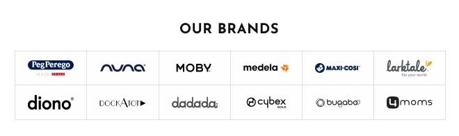

Drag & drop **Layout** widget to a particular region. Set **Columns** = `6`. Enter **Name** = `beautify-brands-grid` to appear as below screenshot:

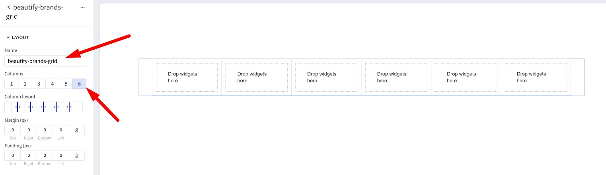

Set **Image width** = `400`, **Image height** = `530`.

Drag & drop **Image** widget to all columns:

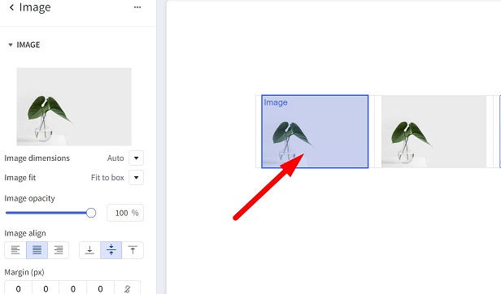

Repeat the above steps create another row.

The result looks like this screenshot:

### Leaderboard Banner

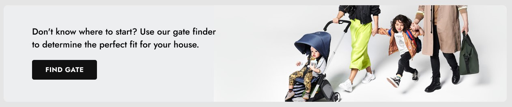

Follow [Leaderboard Banner instruction](#leaderboard-banner) in Cosmetics style to add the widget.

Choose **Content align** = `Right`.

### Instagram Photos

To display your Instagram photos, use our [Instagram App](https://instagram.papathemes.com/), follow the instruction on that page to generate the code. Copy all the code in step 1 and step 2:

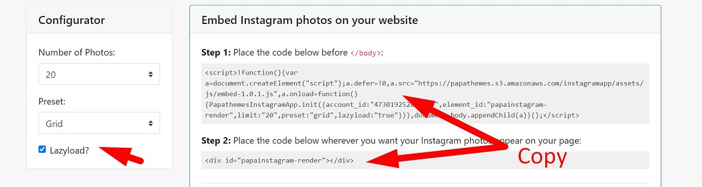

Drag & drop **HTML** widget to a particular region, paste the code to the HTML editor:

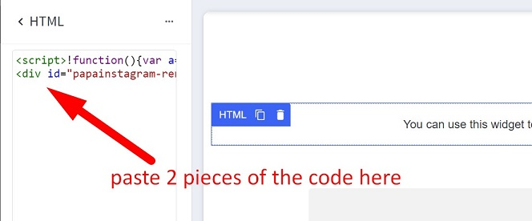

Click **Save HTML** button, you could see the result looks like this:

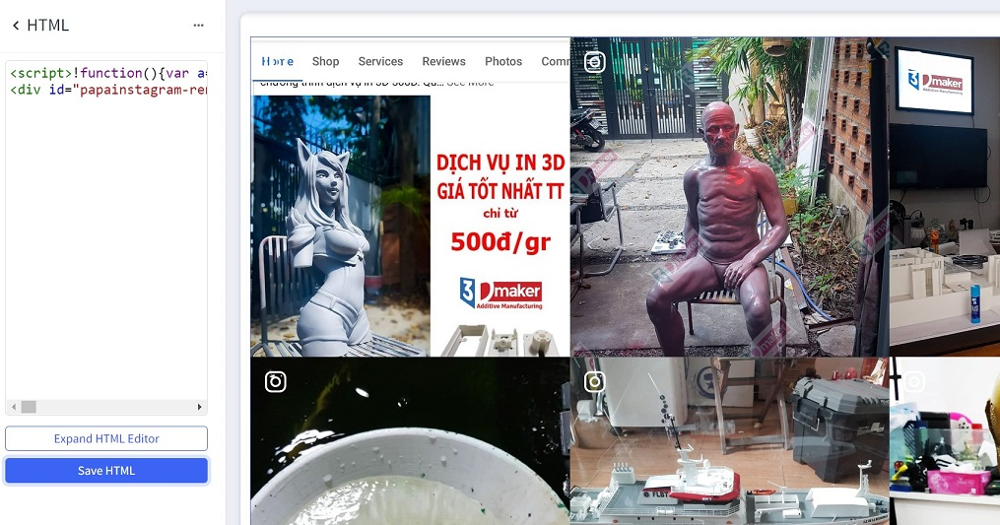

## Setting Up Grocery Home Page

In **Page Builder** > **Theme Styles**, if your current style is not Grocery, click on **Grocery** thumbnail to apply:

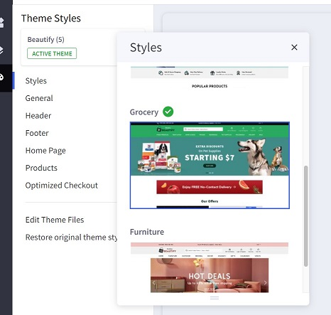

### General

These features are same as Cosmetics style:

- [Top Banner](#top-banner)
- [Header](#header)
- [Home Page Carousel](#home-page-carousel)
- [Content Arrangement](#content-arrangement)
- [New / Featured / Popular Products](#new-featured-popular-products)
- [Newsletter Subscription Form](#newsletter-subscription-form)
- [Footer](#footer)
- [Copyright](#copyright)
- [Payment Icons & GeoTrust SSL Seal](#payment-icons-geotrust-ssl-seal)
- [Leaderboard Banner](#leaderboard-banner)
- [Flex Banners](#flex-banners)
- [Spacer Widget](#spacer-widget)
- [Customer Reviews Slider (or Testimonials)](#customer-reviews-slider-or-testimonials)

### Leaderboard Banner

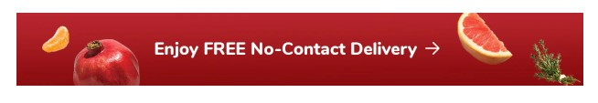

Follow [Leaderboard Banner instruction](#leaderboard-banner) in Cosmetics style to add the widget.

### Flex Banners

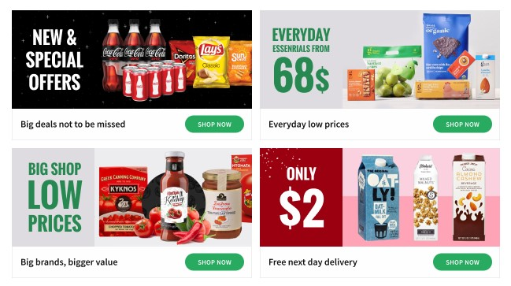

Follow [Flex Banners instruction](#flex-banners) in Cosmetics style to add the widget.

For each banner, choose **Style for theme** = `Beautify Grocery`, enable **Action button** to display the Shop Now button.

### Products Feed

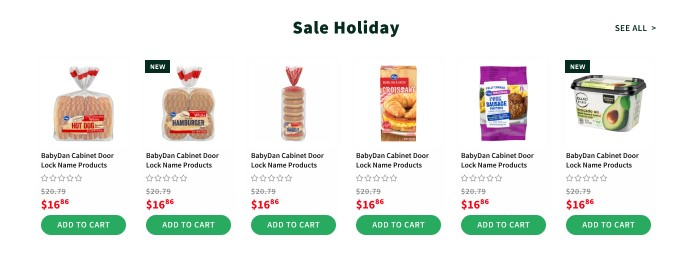

To display products feed from a particular category, create a category (ie. Sale Holiday), then add products to this category.

Drag & drop **Products Feed | PapaThemes Beautify** widget to a particular region.

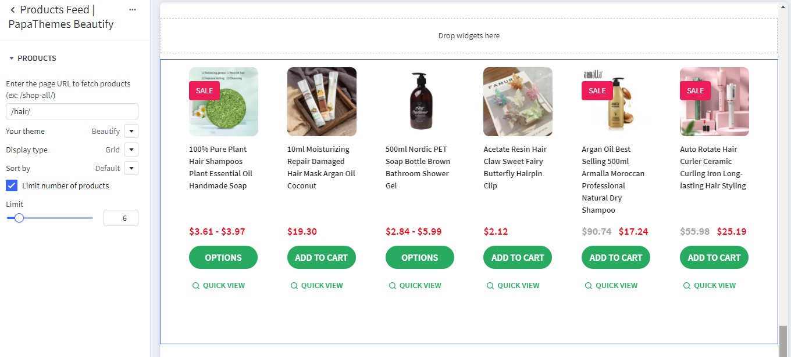

- Enter the category URL, for example `/sale-holiday/`.
- Choose **Your theme** = `Beautify`.
- **Limit number of products** = `6`.

Configuring number of products row in **Page Builder** > **Theme Styles** > **Home Page** > **Third-party widgets** > set the value of **Columns in Products Feeds widgets**.

### Category Banners

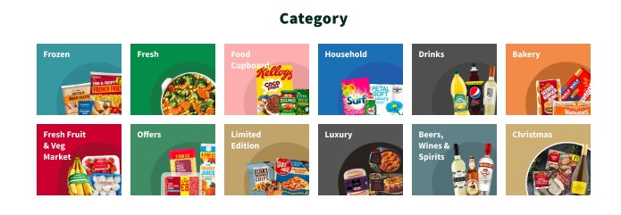

Drag & drop **Layout** widget to a particular region. Set **Columns** = `6`. Enter **Name** = `beautify-grid6` to appear as below screenshot:

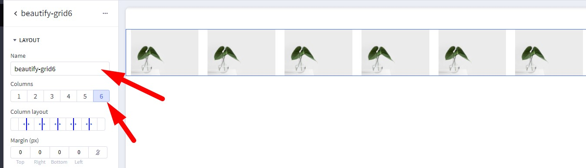

Set **Image width** = `400`, **Image height** = `530`.

Drag & drop **Image** widget to all columns:

Repeat the above steps create another row. Add some spacing using Spacer widget.

The result looks like this screenshot:

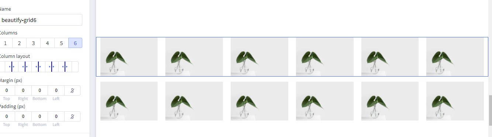

### Customer Reviews Slider (or Testimonials)

Follow [Customer Reviews Slider (or Testimonials) instruction](#customer-reviews-slider-or-testimonials) in Cosmetics style to add the widget.

For each review, set **Style for theme** = `Beautify Grocery`.

In **Page Builder** > **Theme Styles** > **Home Page** > **Third-pary widgets** > Set **Customer reviews per slide** = `1`.

### Recent Blog

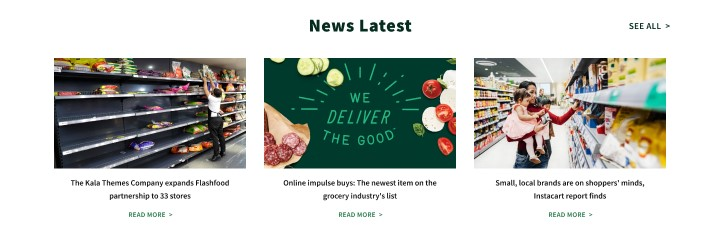

Configuring the recent blog on home page in **Page Builder** > **Theme Styles** > **Home Page** > **Recent Blog**:

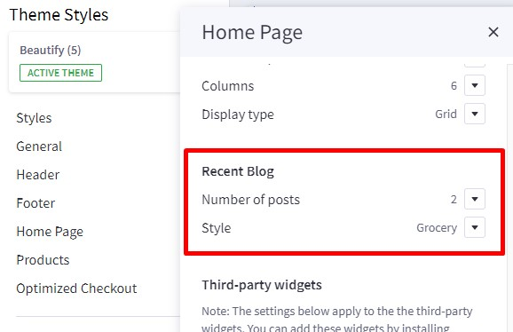

You can configure Number of posts to display, and display style.

### Callout Icons

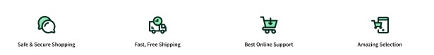

Follow [Callout Icons instruction](#callout-icons) in Cosmetics style to add the widget.

Set **Icon color** = `#94E9B9` for each callout icon.

### Newsletter Subscription Form

Follow [Newsletter Subscription Form instruction](#newsletter-subscription-form) in Cosmetics style configure this form.

In **Page Builder** > **Theme Styles** > **Footer** > **Newsletter** > set **Style** = `Grocery`.

## Setting Up Furniture Home Page

In **Page Builder** > **Theme Styles**, if your current style is not Furniture, click on **Furniture** thumbnail to apply:

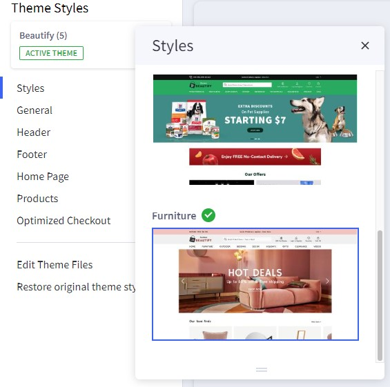

### General

These features are same as Cosmetics style:

- [Top Banner](#top-banner)
- [Header](#header)
- [Home Page Carousel](#home-page-carousel)
- [Content Arrangement](#content-arrangement)
- [New / Featured / Popular Products](#new-featured-popular-products)
- [Newsletter Subscription Form](#newsletter-subscription-form)
- [Footer](#footer)
- [Copyright](#copyright)
- [Payment Icons & GeoTrust SSL Seal](#payment-icons-geotrust-ssl-seal)
- [Leaderboard Banner](#leaderboard-banner)
- [Flex Banners](#flex-banners)
- [Spacer Widget](#spacer-widget)
- [Customer Reviews Slider (or Testimonials)](#customer-reviews-slider-or-testimonials)

### Category Banners

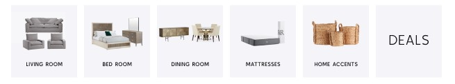

Follow [Category Banners instruction](#category-banners) in Grocery style to add this category banners

### Who We Are

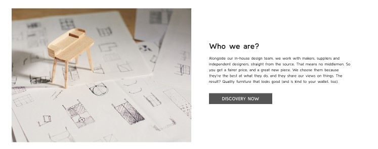

### Instagram Photos

Please follow [Instagram Photos instruction](#instagram-photos) in Family style.

### Customer Reviews

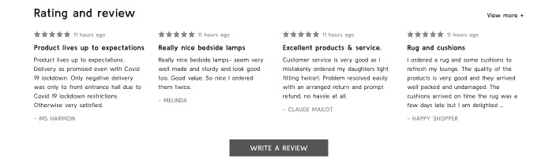

### Hero Banners

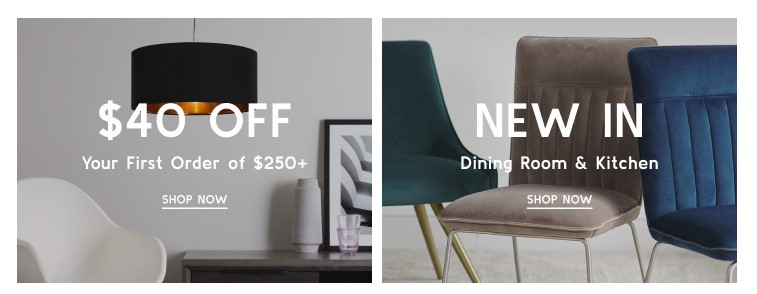

### Newsletter Subscription Form

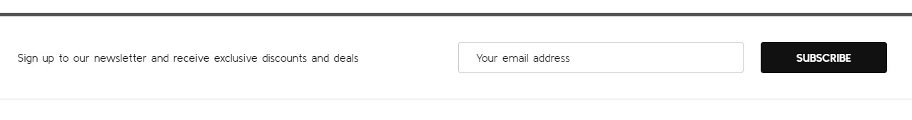

Follow [Newsletter Subscription Form instruction](#newsletter-subscription-form) in Cosmetics style configure this form.

In **Page Builder** > **Theme Styles** > **Footer** > **Newsletter** > set **Style** = `Grocery`.

## Customizing Product Pages

## Customizing Category Pages

