# Usage Guide

## Get Started

Thanks for using our theme!

To set up the theme exactly like our demo stores, you may need to install the our free app **[PapaThemes Widgets](https://www.bigcommerce.com/apps/papathemes-widgets/)**. This app provides additional widgets to build the content in Page Builder visually without coding skill. 

For displaying your Instagram photos on your website, you can use our free tool **[PapaThemes Instagram](https://instagram.papathemes.com/)**. We will guide you step by step later in this manual.

### Customzing Typography, Fonts and Colors

Customzing Typography, Fonts and Colors, Buttons in **Page Builder** > **Theme Styles** > **General**. There are dozens of options to help you customize your website beautifully and uniquely.

### Customzing Checkout Page's Typography and Colors

Customzing the checkout page's typography and colors in **Page Builder** > **Theme Styles** > **Optimized Checkout**

### Installing PapaThemes Widgets App

Find and install **[PapaThemes Widgets](https://www.bigcommerce.com/apps/papathemes-widgets/)** app from [BigCommerce Apps Marketplace](https://www.bigcommerce.com/apps/).

After installed, go to your admin page, on the left sidebar, click **Apps** >** My Apps**, click **Launch** button of PapaThemes Widgets app to open the app:

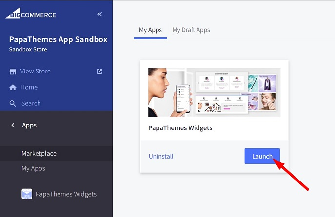

Then click the Install buttons in turn to install all widgets for Beautify theme:

Go to **Storefront** > **My Themes** > click **Customize** in dropdown menu of Beautify theme to open Page Builder. Select any theme style to start:

Verify the widgets installed successfully if they appear in Page Builder:

## Setting Up Cosmetics Home Page

In your admin page, go to **Storefront** > **My Themes**, click **Customize** in the dropdown menu of Beautify theme, select **Cosmetics** style, then click **Continue** button to open Page Builder.

### Top Banner

To create the top banner, go to **Marketing** > **Banners** > click **Create a Banner** button.

Enter Banner Name, Banner Content. Select **Show on Page** = `Home Page`. Select **Location** = `Top of Page`. Then click **Save** button to finish.

Configuring the top banner colors in **Page Builder** > **Theme Styles** > **General** > **Top Banners**:

### Header

Editing the phone number in **Store Setup** > **Store Profile** > **Phone**.

Editing the currencies list in **Store Setup** > **Currencies**.

The announcement (ie: _Covid 19 Delivery Update: Click Here_) displays on all pages. Drag the Text widget to this region to add it:

Changing the header's background color, the site name's text color, toggle auto hide/show header in **Page Builder** > **Theme Styles** > **Header** as showed in the screenshot below:

Changing the icons and links's colors (ie. Sign in & Register, Gift Certificates, Cart) in **Theme Styles** > **Headers** > **User navigation**:

Changing the main navigation's colors in **Theme Styles** > **Header** > **Main navigation**:

Changing the quick search form in **Theme Styles** > **Header** > **Quick search**:

### Home Page Carousel

Creating the home page carousel in **Storefront** > **Home Page Carousel**.

You can:

- Turn off / on the home page carousel.
- Change colors.
- Change the content position of each slide.

Go to **Page Builder** > **Theme Styles** > **Home Page** > **Carousel**:

### Content Arrangement

You can arrange the content of the home page in Page Builder > Theme Styles > Home Pages > Sections, choose the content to display on each position.

### New / Featured / Popular Products

You can configure number of products to display, number of products per row, display type (grid or carousel) in **Page Builder** > **Theme Styles** > **Home Page** > **Featured products** or **New products** or **Best-sellers products**:

To set product as Featured, edit the product, select **Set as a Featured Product on my Storefront** as the screenshot below:

Popular products are automatically assigned by BigCommerce based on customer order analysis.

New products are automatically assigned by BigCommerce based on the product's added date.

### Newsletter Subscription Form

Enabling the newsletter subscription feature in **Marketing** > **Email Marketing**, tick on **Allow Newsletter Subscriptions**, enter the summary content in **Show Newsletter Summary** box if you want. See below screenshot for example:

You can configure the heading, display style, colors, background image and toggle this newsletter form on the footer in **Page Builder** > **Theme Styles** > **Footer** > **Newsletter**:

### Footer

Configuring the footer in **Page Builder** > **Theme Styles** > **Footer** > **Main Footer**:

Configuring the social icons in **Storefront** > **Social Media Links**.

You can also add the custom cotent to the footer using widgets. Just drag the widget to the available regions:

### Copyright

Configuring the copyright's colors in **Page Builder** > **Theme Styles** > **Footer** > **Copyright**:

You can also toggle "Powered by BigCommerce" and "© current year and store name".

### Payment Icons & GeoTrust SSL Seal

Configuring the payment icons in **Page Builder** > **Theme Styles** > **Footer** > **Payment icons**:

Configuring GeoTrust SSL seal in **Page Builder** > **Theme Styles** > **Footer** > **GeoTrust SSL**:

Note that GeoTrust SSL seal only displays if you purchase GeoTrust SSL Certificate from BigCommerce. Read more details [here](https://support.bigcommerce.com/s/article/BigCommerce-SSL-Certificate#features).

### Callout Icons

To display these icons, drag and drop **Callout Icons | PapaThemes Beautify** widget to the particular region:

For Cosmetics style choose **Style** = `Large`, **Icon color** = `#ecb9e4`, **Icon size** = `Original`, **Text** style = `Theme`.

Select an icon in **Icon** list. You can also input your custom icon if selecting **Icon** = `Custom` then in put the SVG file content to the next text box. Or if selecting **Icon** = `Choose Image`, you can upload your image file.

Enter the link in **Link** text box.

Click **Save** button to save your changes.

### Leaderboard Banner

Drag & drop **Leaderboard Banner | PapaThemes Beautify** widget to a particular region.

Click on the text or button to edit its content.

#### Widget Settings:

**Banners:**

- **Banner link**: Enter the banner link.
- **Content align**: setting content aligment left, center or right.
- **Banner height**: Specify the image height.
- **Background color**: Input the background color.
- **Image**: Upload your image.
- **Image alt text**: Image altenative text.
- **Image fit**: Display image fit to the box or cover the box.
- **Lazy-load?**: Use lazy-load image.

Text: 

- **Description style**: Text style, set `Theme` to use the theme style.
- **Text color**: Text color on desktop.
- **Text color** (mobile): Text color on mobile.

Button:

- **Button**: Show or hide the button.
- **Button style**: set `Theme default` to use the theme style.

### Flex Banners

Drag & drop **Flex Banners | PapaThemes Beautify** widget to a particular region.

Click on the text or button to edit its content.

#### Widget Settings:

- **Image**: Upload your image.
- **Image width**: Specify the image width.
- **Image height**: Specify the image height.
- **Show different** image on mobile: Allows displaying a different image on mobile.
- **Image alt text**: Image alternative text.
- **Image fit**: Display image fit to the box or cover the box.
- **Lazy-load?**: Use lazy-load image.
- **Link**: Enter the banner link.
- **Show text**: Toggle text visibility.
- **Text style**: specify text style using the theme style or custom.
- **Content align**: align content left, right or center, top, bottom or middle.
- **Content padding**: Spacing around the text.
- **Action button**: Toggle the button visibility.
- **Style for theme**: pre-styled for some particular theme.
- **Your theme name**: Enter your theme name to allow you to customize its style using CSS.

### Spacer Widget

**Spacer | PapaThemes Beautify** widget allows adding spacing between widgets. It also supports different spacing on desktop, tablet and mobile.

### Customer Reviews Slider (or Testimonials)

Drag & drop **Customer Reviews | PapaThemes Beautify** widget to a particular region.

Click on the text or button to edit its content.

#### Widget Settings:

- **Avatar**: Choose avatar image or avatar color.
- **Title**: The review title.
- **Content**: The review content.
- **Rating**: The rating stars.
- **Author**: Reviewer name.
- **Style for theme**: pre-styled for some particular theme.
- **Your theme name**: Enter your theme name to allow you to customize its style using CSS.

## Setting Up Family Home Page

In **Page Builder** > **Theme Styles**, if your current style is not Family, click on **Family** thumbnail to apply:

### General

These features are same as Cosmetics style:

- [Top Banner](#top-banner)
- [Header](#header)
- [Home Page Carousel](#home-page-carousel)
- [Content Arrangement](#content-arrangement)
- [New / Featured / Popular Products](#new-featured-popular-products)
- [Newsletter Subscription Form](#newsletter-subscription-form)
- [Footer](#footer)
- [Copyright](#copyright)
- [Payment Icons & GeoTrust SSL Seal](#payment-icons-geotrust-ssl-seal)
- [Leaderboard Banner](#leaderboard-banner)
- [Flex Banners](#flex-banners)
- [Spacer Widget](#spacer-widget)
- [Customer Reviews Slider (or Testimonials)](#customer-reviews-slider-or-testimonials)

### Callout Icons

Follow [Callout Icons instruction](#callout-icons) in Cosmetics style to add the widget.

Set **Style** = `Left` and **Icon color** = `#97F9FF` for each callout icon. You can use the inline text editor to format the text font size and weight as you want.

### Flex Banners

Follow [Flex Banners instruction](#flex-banners) in Cosmetics style to add the widget.

### Customer Reviews Slider (or Testimonials)

Follow [Customer Reviews Slider (or Testimonials) instruction](#customer-reviews-slider-or-testimonials) in Cosmetics style to add the widget.

In **Page Builder** > **Theme Styles** > **Home Page** > **Third-party widgets**, choose **Columns in Products Feed widget**
 = `4`.

### Brands Logo

Drag & drop **Layout** widget to a particular region. Set **Columns** = `6`. Enter **Name** = `beautify-brands-grid` to appear as below screenshot:

Set **Image width** = `400`, **Image height** = `530`.

Drag & drop **Image** widget to all columns:

Repeat the above steps create another row.

The result looks like this screenshot:

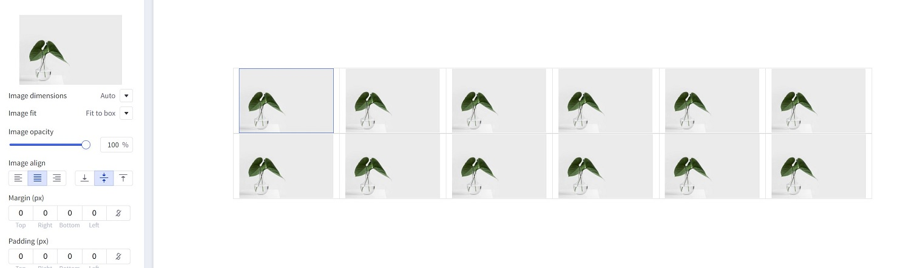

### Leaderboard Banner

Follow [Leaderboard Banner instruction](#leaderboard-banner) in Cosmetics style to add the widget.

Choose **Content align** = `Right`.

### Instagram Photos

To display your Instagram photos, use our [Instagram App](https://instagram.papathemes.com/), follow the instruction on that page to generate the code. Copy all the code in step 1 and step 2:

Drag & drop **HTML** widget to a particular region, paste the code to the HTML editor:

Click **Save HTML** button, you could see the result looks like this:

## Setting Up Grocery Home Page

In **Page Builder** > **Theme Styles**, if your current style is not Grocery, click on **Grocery** thumbnail to apply:

### General

These features are same as Cosmetics style:

- [Top Banner](#top-banner)
- [Header](#header)
- [Home Page Carousel](#home-page-carousel)
- [Content Arrangement](#content-arrangement)
- [New / Featured / Popular Products](#new-featured-popular-products)
- [Newsletter Subscription Form](#newsletter-subscription-form)
- [Footer](#footer)
- [Copyright](#copyright)
- [Payment Icons & GeoTrust SSL Seal](#payment-icons-geotrust-ssl-seal)
- [Leaderboard Banner](#leaderboard-banner)
- [Flex Banners](#flex-banners)
- [Spacer Widget](#spacer-widget)
- [Customer Reviews Slider (or Testimonials)](#customer-reviews-slider-or-testimonials)

### Leaderboard Banner

Follow [Leaderboard Banner instruction](#leaderboard-banner) in Cosmetics style to add the widget.

### Flex Banners

Follow [Flex Banners instruction](#flex-banners) in Cosmetics style to add the widget.

For each banner, choose **Style for theme** = `Beautify Grocery`, enable **Action button** to display the Shop Now button.

### Products Feed

To display products feed from a particular category, create a category (ie. Sale Holiday), then add products to this category.

Drag & drop **Products Feed | PapaThemes Beautify** widget to a particular region.

- Enter the category URL, for example `/sale-holiday/`.
- Choose **Your theme** = `Beautify`.
- **Limit number of products** = `6`.

Configuring number of products row in **Page Builder** > **Theme Styles** > **Home Page** > **Third-party widgets** > set the value of **Columns in Products Feeds widgets**.

### Category Banners

Drag & drop **Layout** widget to a particular region. Set **Columns** = `6`. Enter **Name** = `beautify-grid6` to appear as below screenshot:

Set **Image width** = `400`, **Image height** = `530`.

Drag & drop **Image** widget to all columns:

Repeat the above steps create another row. Add some spacing using Spacer widget.

The result looks like this screenshot:

### Customer Reviews Slider (or Testimonials)

Follow [Customer Reviews Slider (or Testimonials) instruction](#customer-reviews-slider-or-testimonials) in Cosmetics style to add the widget.

For each review, set **Style for theme** = `Beautify Grocery`.

In **Page Builder** > **Theme Styles** > **Home Page** > **Third-pary widgets** > Set **Customer reviews per slide** = `1`.

### Recent Blog

Configuring the recent blog on home page in **Page Builder** > **Theme Styles** > **Home Page** > **Recent Blog**:

You can configure Number of posts to display, and display style.

### Callout Icons

Follow [Callout Icons instruction](#callout-icons) in Cosmetics style to add the widget.

Set **Icon color** = `#94E9B9` for each callout icon.

### Newsletter Subscription Form

Follow [Newsletter Subscription Form instruction](#newsletter-subscription-form) in Cosmetics style configure this form.

In **Page Builder** > **Theme Styles** > **Footer** > **Newsletter** > set **Style** = `Grocery`.

## Setting Up Furniture Home Page

In **Page Builder** > **Theme Styles**, if your current style is not Furniture, click on **Furniture** thumbnail to apply:

### General

These features are same as Cosmetics style:

- [Top Banner](#top-banner)
- [Header](#header)
- [Home Page Carousel](#home-page-carousel)
- [Content Arrangement](#content-arrangement)
- [New / Featured / Popular Products](#new-featured-popular-products)
- [Newsletter Subscription Form](#newsletter-subscription-form)
- [Footer](#footer)
- [Copyright](#copyright)
- [Payment Icons & GeoTrust SSL Seal](#payment-icons-geotrust-ssl-seal)
- [Leaderboard Banner](#leaderboard-banner)
- [Flex Banners](#flex-banners)
- [Spacer Widget](#spacer-widget)
- [Customer Reviews Slider (or Testimonials)](#customer-reviews-slider-or-testimonials)

### Category Banners

Follow [Category Banners instruction](#category-banners) in Grocery style to add this category banners

### Leaderboard Banner

Please follow [Leaderboard Banner instruction](#leaderboard-banner) in Cosmetics style to display this banner.

### Instagram Photos

Please follow [Instagram Photos instruction](#instagram-photos) in Family style to display Instagram photos.

### Customer Reviews

Follow [Customer Reviews Slider (or Testimonials) instruction](#customer-reviews-slider-or-testimonials) in Cosmetics style to add the widget.

In each review item, select **Style for theme** = `Beautify Furniture`.

### Flex Banners

Pleae follow [Flex Banners instruction](#flex-banners) in Cosmetics style to display these hero banners.

In each banner, enable **Show heading**, **Show description** and **Action button**. Click on the brush icon next to Action button to open Action button setting panel, choose **Style** = `underline`.

### Newsletter Subscription Form

Follow [Newsletter Subscription Form instruction](#newsletter-subscription-form) in Cosmetics style configure this form.

In **Page Builder** > **Theme Styles** > **Footer** > **Newsletter** > set **Style** = `Grocery`.

## Customizing Products Display

### Product Card

Configuring product cards in **Page Builder** > **Theme Styles** > **Products** > **Product cards**.

- **Alignment**: Specifying content alignment `left` or `center`.
- **Product title color**: Specifying the product name's color.
- + **Hover**: Specifying color when hover or focus.
- **Button text color**: Specifying the button text color.
- + **Background**: Specifying the button background color.
- + **Border**: Specifying the button border color.
- **Show second image on hover**: Displaying the second image when hover the product card.

### Displaying product price ranges

By default product price ranges is enabled. To turn off, Go to **Page Builder** > **Theme Styles** > **Products** > uncheck **Price ranges** checkbox.

### Hiding prices for non logged in customers

To turn on this feature, go to **Page Builder** > **Theme Styles** > **Products** > tick **Restrict Purchase to Login** checkbox.

### Redirecting to cart page after product added to cart

By default the cart popup is displayed, if you want to take customer to the cart page instead, go to **Page Builder** > **Theme Styles** > **Products** > tick **Redirect to cart page after add to cart** checkbox.

### Showing/Hiding Quick-View button

By default quick-view buttons appear on all product cards. To hide it, go to **Page Builder** > **Theme Styles** > **Products** > untick **Show Quickview** checkbox.

### Showing/Hiding the quantity box on PDP

By default the quantity box shows up, to hide it, go to **Page Builder** > **Theme Styles** > **Products** > untick **Show quantity selection on product pages** checkbox.

### Customizing the popup displayed after product added to cart

In **Page Builder** > **Theme Styles** > **Products** > **Popup after added to cart**:

- `Default`: Displaying the large popup.
- `Mini`: Displaying a smaller popup that has auto close.
- `Hide`: Not show any popup.

Mini added to cart popup:

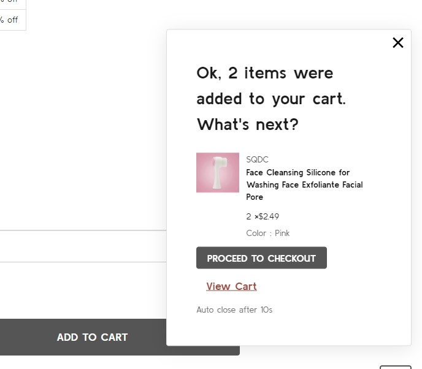

### Displaying Recently Viewed Products

Recently viewed products only display for logged-in customers.

To enable it, go to **Page Builder** > **Theme Styles** > **Products** > **Show recently viewed** select number of products to display.

### Customizing Price Labels

You can customize sale price label, before sale price label, retail price label or regular price label in 
**Page Builder** > **Theme Styles** > **Products** > **Price Labels**

### Displaying product weight, dimensions on PDP

Go to **Page Builder** > **Theme Styles** > **Products** > **Product Page**.

- Tick **Show product weight** checkbox.
- Tick **Show product dimensions** checkbox.

### Displaying product image thumbnails vertically or horizontally

**Page Builder** > **Theme Styles** > **Products** > **Product Page**, tick **Show image thumbnails vertically** to display product thumbnails vertically, otherwise it's displayed horizontally.

### Displaying product bulk pricing inline in table

Instead of displaying bulk pricing in a popup modal, you can display it inline by going to **Page Builder** > **Theme Styles** > **Products** > **Product Page**, tick **Show bulk price as table**.

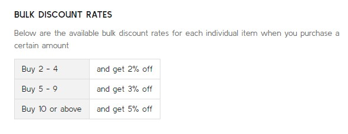

### Displaying product custom fields in a separated tab

In **Page Builder** > **Theme Styles** > **Products** > **Product Page**:

- Tick **Show custom fields in tab** checkbox.
- Enter the tab title in the next **Tab title** box.

### Displaying Delivery & Returns tab

In **Page Builder** > **Theme Styles** > **Products** > **Product Page**:

- Tick **Show Delivery & Returns tab** checkbox.
- Enter the tab title in the next **Tab title** box.

You can add specific content or global content using BC widgets:

### Numbers of products, reviews, thumbnails

In **Page Builder** > **Theme Styles** > **Products** > **Product Page**:

- **Number of Product Reviews**: Specifying number of product reviews displayed.
- **Number of Related Products**: Specifying number of related products displayed.
- **Number of Customers Also Viewed Products**: Specifying number of customer also viewed products displayed.
- **Number of visible thumbnails**: Specifying number of images displayed in the product thumbnails slider.

### Displaying Swatch Options in the dropdown select box

In **Page Builder** > **Theme Styles** > **Products** > **Swatch display type**:

- Default (Square): Displaying the regular swatches by default.
- Dropdown: Displaying swatches in the dropdown select box.
- Dropdown + Square: Displaying swatches in the dropdown select box in addition to regular swatches.

### Displaying Frequently Bought Together Products

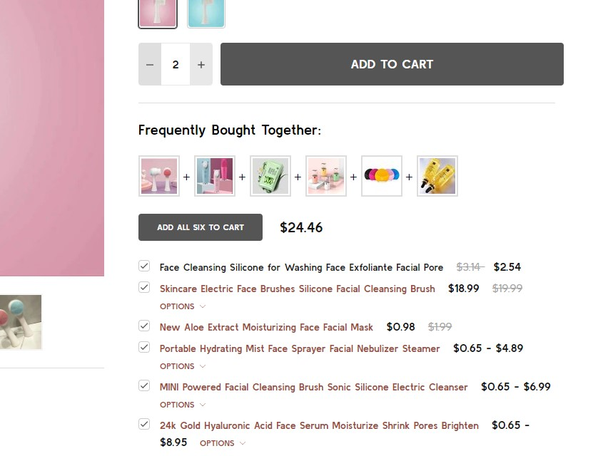

Enabling this feature in **Page Builder** > **Theme Styles** > **Products** > **Frequently Bought Together**, Select **Position** to display it.

- **Load products from**: Specifing products to display here.
  - `Custom fields __alsobought`: Specifying the relevant products in product custom fields with name `__alsobought` and value is the relevant product ID. For example:
  
  - `Related products`: Pulling from the related products.
  - `Similar by biews`: Pulling from customer also viewed products.
- **Auto select all items**: Auto select or unselect all frequently bought together products.
- **Thumbnail size**: Specifying the thumbnail image size.
### Configuring swatch dimension

In **Page Builder** > **Theme Styles** > **Products** > **Swatch display type** > Set **Swatch size**.

### Sale badge, Condition badge and custom text badges

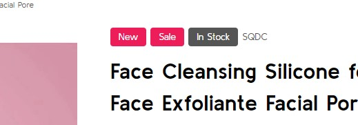

Displaying the sale badge in **Page Builder** > **Theme Styles** > **Products** > **Product sale badges**, tick **Show sale badges**.

- **Label**: Specifying the badge text.
- **Text color**: Specifying the badge text color.
- **Background color**: Specifying the badge background color

Displaying the condition badge in **Condition badges**, tick **Show condition badges**.

Displaying the condition badge in **Custom badges**, tick **Enable custom badget from '__badge' custom field**. Edit product, add custom field with name `__badge` and value is the badge text.

- **Text color**: Specifying the text color of the custom badge.
- **Background color**: Specifying the background color of the custom badge.

### Configuring image sizes

In **Page Builder** > **Theme Styles** > **Products** > **Image Sizes**:

- Main product images: Specifying the main product image size displayed on PDP.
- Thumbnail image: Specifying the product thumbnail size.
- Zoomed image: Specifying the zoomed image size.
- Image in gallery view: Specifying product card image size.

## Customizing Category Pages

Configuring the category pages in **Page Builder** > **Theme Styles** > **Products** > **Category Page**.

### Products Display Type

Theme supports displaying products in grid mode (2, 3, 4 or 6 products per row) or in list mode or bulk order mode. In **Products display type**, select the particular display mode.

- **Show bulk order mode (if select, list mode replaced by bulk order mode)**: if selected, the Bulk Order layout mode will display instead of the regular list mode.

**Grid 6 columns:**

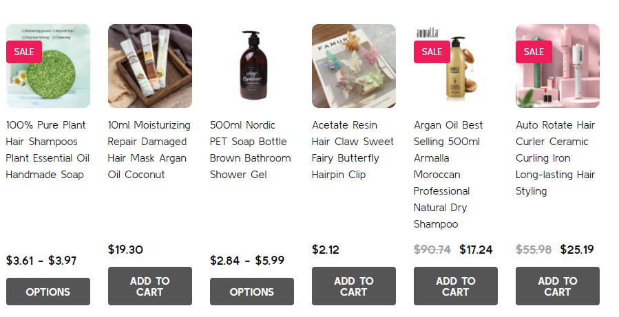

**Bulk Order mode:**

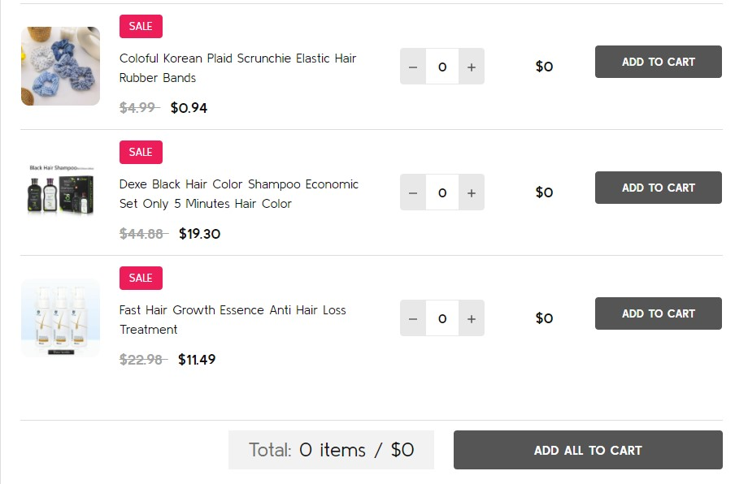

**List mode:**

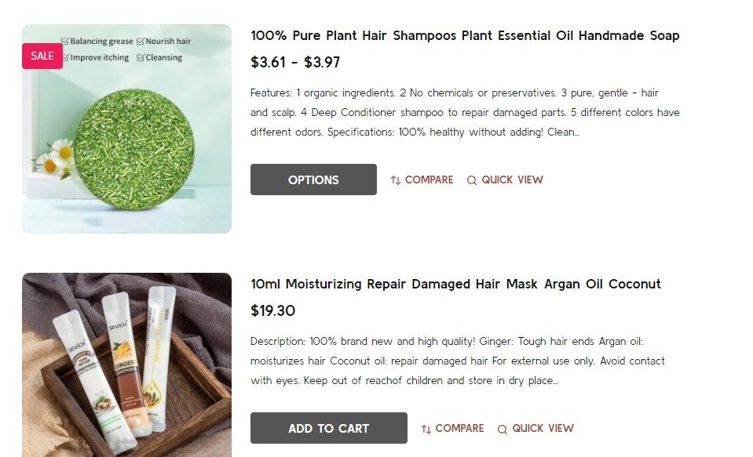

### Displaying Shop by Brand

- **Shop by Brand**: Specifing number of popular brands to display.

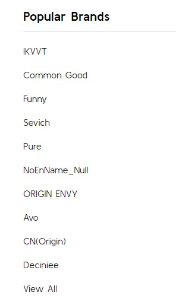

### Displaying Price Slider

- **Shop by Price**:
  - `Slider`: Displaying the price slider.
  - `List`: Displaying price list.
  - `Hide`.

### Display Bulk Order layout

To display this bulk order layout, select **Products display type** = `List`, and tick **Show bulk order mode (if select, list mode replaced by bulk order mode)**.

### Display contextual search

This feature allows searching products within the current category and the current selected filter.

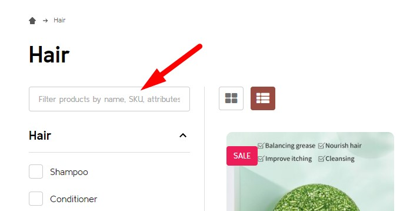

Select **Show quick search in category** = `Show` to enable it.

- **+ Show results in descendent categories**: if selected, it also displays results in the descentent categories.

### Display subcategory image thumbnails

This feature allow displaying subcategory thumbnails before products.

Select **Show subcategory thumbnails** to enable it.

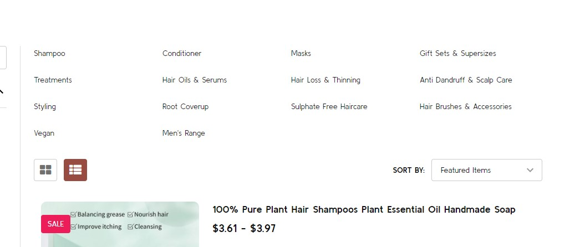

### Common Settings

- **Number of products per page**: Specifying number of products to display per page.
- **Show category image**: Displaying the catgory image or not.
- **Show category description on AMP page**: Displaying category description on AMP category page or not. If the category content contains images, the AMP page could be invalid. It's recommended to turn off this option.

## Customizing Brand Page & Search Page

Configuring the brand page in **Page Builder** > **Theme Styles** > **Products** > **Brand Page**.

- **Number of brands per page**: Specifying number of brands to display per page.
- **Number of products per page**: Specifying number of products to display per page.
- **Brand image in gallery view**: Specifying the brand card image size.
- **Brand image in brand page**: Specifying the large image size displayed on the brand page.

Configuring the search results page in **Page Builder** > **Theme Styles** > **Products** > **Search results**.

- **Number of products per page**: Specifying number of products to display on the search results page.

